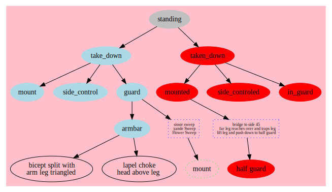

# Jujitsu Moves

Jujitsu moves documented in Graphiz.
The manual is
[here](https://www.graphviz.org/pdf/dotguide.pdf)
and website is
[here](https://www.graphviz.org/).
Developed the diagram below using VSCode to preview and export the image via an
[extension](https://marketplace.visualstudio.com/items?itemName=EFanZh.graphviz-preview).
Installed on Mac via `brew installl graphviz`.
Output generated via
`dot -Tsvg jujitsu-moves.dot > jujitsu-moves.svg` or just type in `make`.

